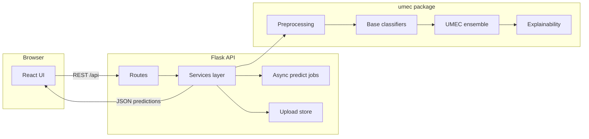
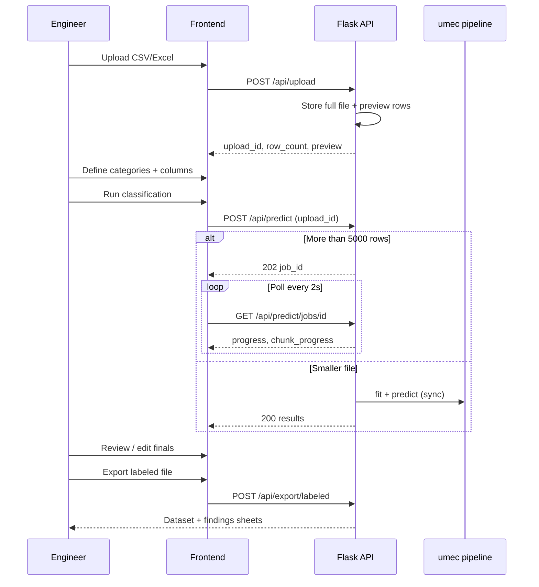
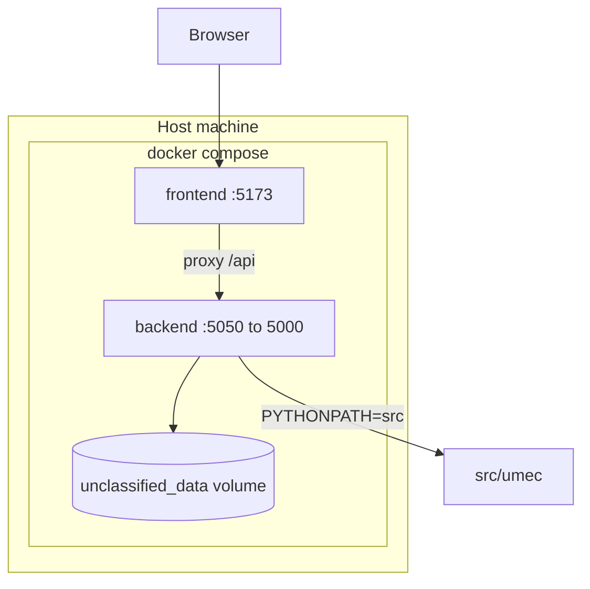
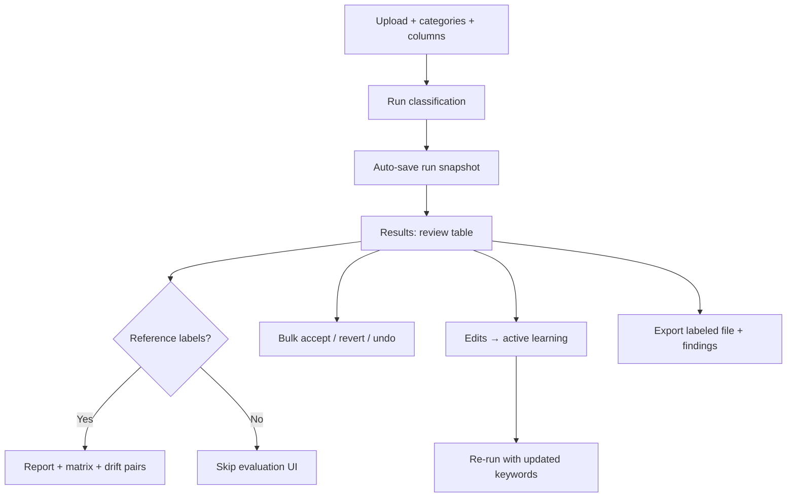
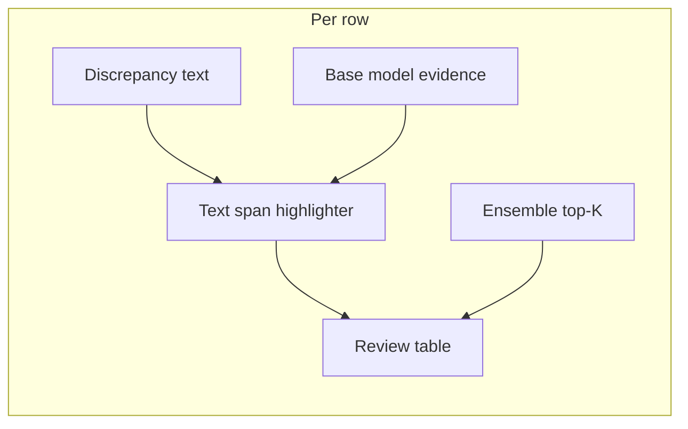

# MaintAI — Maintenance Failure-Mechanism Classification

**MaintAI** is an industry capstone system that classifies unstructured **aircraft / industrial maintenance discrepancy text** into engineer-defined **failure-mechanism labels** (e.g. leaking, corroded, cracked) without requiring a large labeled training set per site.

It implements an **Unsupervised Multi-class Ensemble Classifier (UMEC)** aligned with peer-reviewed research, wrapped in a **production-style web application** for upload → classify → review → export at **100k–170k+ row** scale.

> **Developer setup (install, Docker, CLI, API, troubleshooting):**  
> **[docs/DEVELOPER_GUIDE.md](docs/DEVELOPER_GUIDE.md)**

---

## Table of contents

1. [Problem and goals](#problem-and-goals)
2. [Research foundation](#research-foundation)
3. [System overview](#system-overview)
4. [Architecture](#architecture)
5. [ML pipeline design](#ml-pipeline-design)
6. [Web application design](#web-application-design)
7. [Engineer workflow features](#engineer-workflow-features)
8. [Scalability and reliability](#scalability-and-reliability)
9. [Explainability and human review](#explainability-and-human-review)
10. [Evaluation approach](#evaluation-approach)
11. [Design evolution](#design-evolution)
12. [Repository map](#repository-map)

---

## Problem and goals

Maintenance organisations store free-text **discrepancy narratives** in CMMS exports. Reliability teams want consistent **failure-mechanism tags** for trending, root-cause analysis, and compliance—but face:

| Challenge | How MaintAI addresses it |
|-----------|---------------------------|
| **Little or no labeled data** per site | Unsupervised fit on each upload; engineers supply ~10 category names + keywords |
| **Severe class imbalance** | ECOC + spectral ensemble with **prior-weighted** decoding |
| **Technical vocabulary** (parts, ATA chapters, jargon) | Equipment-based classifier + domain keyword maps + semantic prototypes |
| **Messy exports** | Preprocessing: normalisation, abbreviation expansion, sensitive-field sanitisation |
| **Distrust of black-box ML** | Per-row XAI, confidence tiers, full table review before export |
| **Very large files** | Server-side storage, async jobs, sampled training, chunked scoring |

**Primary users:** maintenance engineers and reliability analysts running pilots on real CMMS extracts—not a one-off notebook experiment.

---

## Research foundation

The ensemble follows the method described in:

> **An unsupervised multi-class ensemble classifier for identifying equipment failure mechanisms from maintenance records**  
> *Reliability Engineering & System Safety*, Vol. 264, 2025.  
> [Elsevier](https://www.sciencedirect.com/science/article/abs/pii/S0951832025006106) · [RePEc](https://ideas.repec.org/a/eee/reensy/v264y2025ipbs0951832025006106.html)

### Method (summary)

1. **Three unsupervised base classifiers** score each class from text using different views of domain knowledge.
2. **ECOC encoding** turns multi-class assignment into binary sub-problems; **max** reduction statistics compare positive vs negative class score groups per bit.
3. **Spectral decomposition** of 2nd/3rd-order moments from ranked reduction statistics across bases.
4. **Imbalance-aware decoding** applies class priors to produce the final label.

### Base classifiers in this repository

| Classifier | Module | Role |
|------------|--------|------|
| **Token matching** | `src/umec/models/token_matching.py` | TF-IDF–weighted ISO/SME-style keywords per class |
| **Equipment-based** | `src/umec/models/equipment_based.py` | Part/component tokens; prominence weights from `configs/mappings/` |
| **Semantic similarity** | `src/umec/models/semantic_similarity.py` | FastText + keyword-augmented sentence vectors; cosine similarity to class prototypes |
| **UMEC ensemble** | `src/umec/models/umec.py` | Combines all three via ECOC → spectral aggregation → prior-weighted decode |

---

## System overview

MaintAI is a **three-tier application**: React UI, Flask API, Python ML core (`umec`). Models are **fit unsupervised on each upload** (on-the-fly) unless the user optionally persists artifacts to disk.



### End-to-end data flow



---

## Architecture

### Logical layers

| Layer | Technology | Responsibility |
|-------|------------|----------------|
| **Presentation** | React 19, Vite, shadcn/ui (zinc dark) | Workflow UI, review table, charts, export modal |
| **API** | Flask, blueprints | Validation, auth-free JSON API, CORS, no ML in routes |
| **Application services** | `backend/app/services/` | On-the-fly fitting, inference orchestration, caching, jobs, dataset store |
| **ML core** | `src/umec/` | Models, preprocessing, resources, pipeline, XAI builders |
| **Configuration** | YAML + JSON maps | Reproducible defaults; per-request overrides from UI settings |
| **Persistence** | Docker volume, optional `models/*.joblib` | Uploads, gzipped job results, optional saved models |

### Key service modules

| Module | Purpose |
|--------|---------|
| `dataset_store.py` | Persists uploads by `upload_id`; serves preview vs full dataframe |
| `on_the_fly.py` | Fingerprints dataset + categories; fits only requested models; in-memory cache |
| `inference.py` | Per-model predict, chunked scoring, progress callbacks, XAI assembly |
| `predict_service.py` | End-to-end predict request; timing metadata |
| `predict_jobs.py` | Background threads for large runs; `chunk_progress` for UI/logs |
| `progress.py` | Structured progress messages (fit / chunk phases) |
| `user_settings.py` | Maps UI analysis settings → model config overrides |
| `evaluation_report.py` | Scoped classification report for API |
| `active_learning.py` | Keyword suggestions from engineer corrections |
| `umec_storage.py` | Run snapshots, feedback archives (`history/`) |

### Deployment topology (Docker Compose)



- Backend **8 GB** memory limit to reduce OOM during long ensemble scoring.
- Vite dev server proxies API calls with **extended timeouts** for large jobs.

---

## ML pipeline design

### On-the-fly unsupervised fit

Each predict request:

1. Loads rows (from JSON body or `upload_id` on disk).
2. Optionally **prepends part/asset column** to narrative text for equipment context.
3. Parses **custom categories** (label + comma-separated keywords); auto-generates keywords from corpus when empty.
4. Preprocesses text (normalisation, token cleanup, resource-driven mappings).
5. **Fits** only the classifiers needed for the selected models (e.g. token-only skips FastText).
6. **Scores** all rows; UMEC may chunk predictions on large frames.

**In-memory cache:** identical dataset fingerprint + categories + model set → reuse fitted assets.

**Optional disk:** `POST /api/train` or CLI `scripts/train.py` writes `models/*.joblib` for repeat CLI/API use (`use_saved_models`).

### Large-dataset mode

When **fast fit** is enabled and row count **> 10,000**, the pipeline applies aggressive limits to avoid OOM:

| Setting | Typical large-file value | Rationale |
|---------|--------------------------|-----------|
| FastText `max_fit_rows` | ~2,500 | Bound embedding training time/memory |
| UMEC `fit_sample_rows` | ~3k–8k (scaled) | Spectral/ECOC fit on representative sample |
| UMEC `predict_chunk_size` | 4,000 | Incremental scoring with progress |
| Spectral components | Reduced | Lighter moment estimates |

Progress is logged per chunk and surfaced to the UI via `chunk_progress` on async jobs.

### Model selection (UI)

Engineers can compare:

- **Token matching** — fastest; keyword-driven.
- **Equipment-based** — part vocabulary and prominence.
- **Semantic similarity** — slowest; captures paraphrase and context.
- **UMEC ensemble** — recommended; fuses all three.

---

## Web application design

### Pages and workflow

| Route | Purpose |
|-------|---------|
| `/` | **Analysis workspace** — upload, categories, column mapping, models, advanced settings, run |
| `/results` | **Review queue** — all rows, filters, confidence slider, chart, export |
| `/history` | List saved runs; reopen full workspace + predictions |
| `/health` | API connectivity check |

### Engineer-centric decisions

- **Categories are per upload / site**, not fixed to 278 CMMS reference codes.
- **All rows remain visible**; “auto-accept” is a review hint, not hidden automation.
- **Macro F1** (when a reference column exists) is computed only over **user-defined categories**, with skipped/unmapped reference values reported separately.
- **Export** produces:
  - **Dataset sheet/file:** original columns + new **ALL CAPS** label column (`FAILURE_MECHANISM` by default).
  - **Findings sheet/file:** confidence, tier, explanation, keywords, agreement.
- **Column and model selections persist** across navigation (shared app state + browser session).
- **Classification report** (when a reference label column was selected at run time): per-class precision/recall/F1, **confusion matrix heatmap**, and **top confusion pairs** — on **Results** and via `scripts/classification_report.py` (see [Developer Guide](docs/DEVELOPER_GUIDE.md)).

### UI stack

- React + Vite, React Router, Tailwind CSS, **shadcn/ui** with **zinc dark** theme.
- Chart.js for label distribution by review status.
- `react-data-grid` for editable upload preview (read-only when preview-only).

---

## Engineer workflow features

Features aimed at real CMMS pilots: survive refresh, reopen runs, speed up review, and improve categories over time.

### Session persistence

| What is saved | Where | Notes |
|---------------|-------|-------|
| Column mapping, models, categories, upload metadata | `sessionStorage` (`maintai_session_v1`) | Survives browser refresh |
| Full prediction payload | Server `history/` snapshot | Too large for sessionStorage on 100k+ row runs |
| Preview rows (≤500 rows) | sessionStorage | Large uploads keep `upload_id` only |

On reload, the workspace restores settings automatically. If a **last run ID** is stored, predictions are fetched from `GET /api/history/<id>`.

Implementation: `frontend/src/utils/sessionPersistence.js`, `frontend/src/context/AppContext.jsx`.

### Run history and reopen

Every successful classification saves a **run snapshot** (`POST /api/history/snapshot`) containing:

- Full prediction results (`results_by_model`, timing, etc.)
- Workspace config (`runConfig`, `analysisConfig`, columns, `upload_id`)

| UI entry | Action |
|----------|--------|
| **Results** (no active run) | **Reopen last run** |
| **Run history** | **Open in Results** on any snapshot |
| **Results** header | Shows short saved run ID |

Snapshots are written under `history/` (gitignored). Legacy feedback-only records remain viewable as before/after JSON.

### Bulk review (Results)

In the review queue, engineers can:

- **Accept all trusted rows** — confirm high-confidence predictions (`final` = `predicted`).
- **Accept trusted for label** — same, filtered by predicted class.
- **Revert all edits** or **revert edits for label** — reset `final` to `predicted`.
- **Undo** — roll back the last bulk action (up to 5 steps).

Component: `frontend/src/components/ReviewBulkActions.jsx`.

### Label drift (confusion insights)

When a **reference label column** was selected at run time, the classification report includes:

1. **Per-class metrics** — precision, recall, F1, support (scoped to your categories only).
2. **Confusion matrix** — scrollable heatmap; **Counts** vs **Row %** toggle; sized for many classes (e.g. 24+).
3. **Top confusion pairs** — e.g. actual `leaking` → predicted `seeping`, sorted by row count — to guide keyword updates.

Backend: `top_confusion_pairs` in `src/umec/evaluation/scoped_report.py`.  
UI: `ConfusionMatrixHeatmap.jsx`, `ConfusionPairsPanel.jsx`.

### Active learning from corrections

When engineers change **Final** away from **Predicted**, the system can:

1. **Suggest keywords** — mine tokens from discrepancy text for the corrected label.
2. **Apply keywords to categories** — merge into the workspace category list for the **next** classification run.

API: `POST /api/feedback/active-learning` with `{ edits, custom_categories, apply: true|false }`.  
UI: `frontend/src/components/ActiveLearningPanel.jsx` on Results.

This is lightweight keyword enrichment (not full model retraining); re-run classification on the workspace to use updated categories.

### End-to-end review flow (summary)



---

## Scalability and reliability

| Concern | Design choice |
|---------|----------------|
| Huge JSON payloads | `upload_id` — full CSV stored server-side after upload |
| HTTP timeouts | Async predict jobs when rows **> 5,000**; client polls `GET /api/predict/jobs/<id>` |
| Browser memory | Preview capped (first **200** rows when upload **> 5,000** rows); results table paginated (no “all rows” render) |
| Backend OOM | Large-dataset config, chunked predict, Docker mem limit, slim XAI payloads on very large result sets |
| Repeat runs | In-memory model cache keyed by dataset + settings fingerprint |
| Browser refresh | sessionStorage + history snapshot restore last workspace/run |

---

## Explainability and human review

MaintAI uses **keyword-evidence explainability** (not SHAP): engineers read the discrepancy narrative as source of truth, with model evidence overlaid on that text.

Each prediction row includes:

- **Predicted** vs **final** (editable) condition.
- **Confidence** and **review tier** (high / medium / low) with adjustable auto-accept threshold.
- **Inline discrepancy highlights** — terms in the original text coloured by role:
  - **Green** — supports the predicted class (keyword / part hit).
  - **Red** — supports a top-ranked alternative class.
  - **Amber** — salient term not mapped to your categories (e.g. CMMS reference wording like `deteriorated` when only `leaking` is defined).
- **Top-K ranked classes** (default K=3, set via `analysis_config.xai_top_k` on predict) with confidence shares.
- **Concise summary** — e.g. `Predicted «leaking» (85%) · Evidence in text: leaking, seal · Next: «damaged» (12%)`.
- **Optional model breakdown** — per-base (token / equipment / semantic) agreement and terms.

Reference labels from CMMS (when mapped at run time) are shown raw in the **Actual** column. Values outside your category list are flagged **Not in categories**; they are used for evaluation only when they map to a defined label, not for training.



The review table is **paginated** (25/50/100 rows per page) with memoised rows so large result sets stay responsive in the browser.

The system is explicitly **human-in-the-loop**: high-volume CMMS text is pre-tagged for analyst spot-checking, not fully autonomous closure.

---

## Evaluation approach

| Aspect | Practice |
|--------|----------|
| **Reference labels** | Optional column in upload; often noisy or inconsistent with engineer taxonomy |
| **Primary metric in UI** | **Macro F1** over user categories only (not all legacy CMMS codes) |
| **Reporting** | Evaluated vs skipped row counts when references do not map to user labels |
| **Comparative baselines** | Prior capstone explored **BERT** supervised fine-tuning; ensemble chosen for label scarcity, imbalance, compute, and domain fit |

Reported accuracy/F1 varies by site, label quality, and category set—treat metrics as **directional** alongside review throughput and export quality.

---

## Design evolution


| Dimension | BERT-based approach (explored) | UMEC + MaintAI (delivered) |
|-----------|-------------------------------|----------------------------|
| Training data | Labeled examples per class | Engineer-defined categories + keywords; fit on upload |
| Class imbalance | Struggled on long-tail mechanisms | ECOC + priors + ensemble diversity |
| Domain language | Generic transformer context | Token + equipment + semantic views |
| Compute | GPU-heavy training/inference | Sampled FastText + chunked CPU scoring |
| Operational fit | Batch offline model | Upload → review → export in browser |

---

## Repository map

```text
Readme.md                 This document (system design & report)
docs/DEVELOPER_GUIDE.md   Install, run, API, CLI, troubleshooting
configs/core/             YAML configuration
configs/mappings/         Keywords, parts, label maps
src/umec/                 ML package
backend/                  Flask API
frontend/                 React application
scripts/                  CLI tools
models/                   Optional saved joblibs
reports/                  Evaluation / prediction outputs
docker-compose.yml        Full-stack local deployment
```

---

## References

- Zio, et al. (2025). *Reliability Engineering & System Safety*, Vol. 264 — UMEC methodology.
- Internal capstone documentation: [Developer Guide](docs/DEVELOPER_GUIDE.md).

---

## License

Internal research / capstone use unless otherwise agreed with industry partners.
